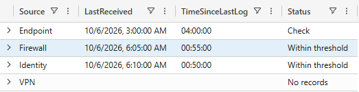

# Sentinel Ingestion Health

A small KQL learning project for checking log source freshness
and identifying expected sources with no matching records.

The examples use synthetic data and run in Azure Data Explorer.
The same KQL concepts can be applied to Microsoft Sentinel,
after adapting the queries to actual tables and source identifiers.

## What it checks

For each expected source, the final query:

- Finds the latest log receipt timestamp.
- Calculates the elapsed time since that timestamp.
- Compares the elapsed time against a configurable threshold.
- Preserves expected sources that have no matching records.

## Query walkthrough

| File | Purpose |
| --- | --- |
| [01-sample-logs.kql](queries/01-sample-logs.kql) | Create synthetic log records |
| [02-last-log-received.kql](queries/02-last-log-received.kql) | Find the latest receipt timestamp per source |
| [03-time-since-last-log.kql](queries/03-time-since-last-log.kql) | Calculate elapsed time since the latest log |
| [04-log-silence-status.kql](queries/04-log-silence-status.kql) | Classify sources using a silence threshold |
| [05-silent-sources.kql](queries/05-silent-sources.kql) | Return only sources exceeding the threshold |
| [06-expected-sources.kql](queries/06-expected-sources.kql) | Include expected sources without matching logs |
| [07-ingestion-health-summary.kql](queries/07-ingestion-health-summary.kql) | Combine the checks into one summary |

## Run the example

1. Open [Azure Data Explorer Samples](https://dataexplorer.azure.com/clusters/help/databases/Samples).
2. Sign in with a Microsoft account.
3. Select the `help` cluster and the `Samples` database.
4. Copy the entire contents of `queries/07-ingestion-health-summary.kql`
   into the query editor.
5. Select the entire query and click **Run**.

No data upload is required. The `datatable` expressions provide
temporary sample data within the query.

## Configuration

The final example uses:

- `ReferenceTime`: `2026-10-06T07:00:00Z`
- `SilenceThreshold`: `2h`

The fixed reference time makes the example reproducible.
All sample timestamps are in UTC.

## Expected result

| Source | LastReceived (UTC) | TimeSinceLastLog | Status |
| --- | --- | --- | --- |
| Endpoint | 2026-10-06 03:00:00 | 04:00:00 | Check |
| Firewall | 2026-10-06 06:05:00 | 00:55:00 | Within threshold |
| Identity | 2026-10-06 06:10:00 | 00:50:00 | Within threshold |
| VPN | null | null | No records |

## Screenshot

## Status meanings

- **Within threshold**: elapsed time is less than or equal to the threshold.
- **Check**: elapsed time is greater than the threshold and requires investigation.
- **No records**: no matching records exist in the input data for the expected source.

## Limitations

This is a learning example, not a deployed monitoring solution.

- Log silence alone does not prove a connector failure.
- `No records` describes the input data being examined, not the source's entire history.
- Production thresholds should reflect each source's expected activity.
- `ReceivedAt` is a synthetic receipt timestamp. Real tables require
  an appropriate timestamp selection; event time and ingestion time
  are different concepts.
- A production version needs actual tables, a maintained source inventory,
  an explicit query lookback window, and validation in the target environment.

## KQL concepts covered

`datatable`, `let`, `summarize`, `max`, `extend`, `iff`,
`where`, `join kind=leftouter`, `isnull`, `case`, `project`,
and `order by`.

## License

MIT. See [LICENSE](LICENSE).
